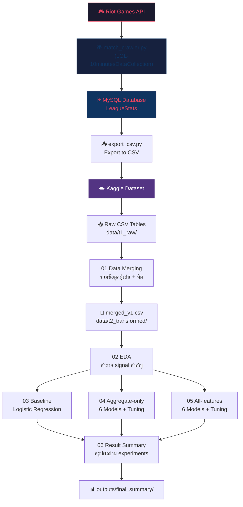

# 🎮 Predicting League of Legends Match Outcomes Using 10-Minute Data

<div align="center">


**โมเดล Machine Learning สำหรับทำนายผลแพ้ชนะของเกม League of Legends จากข้อมูลสถานะเกมช่วง 10 นาทีแรก**

[📊 ผลลัพธ์](#-result-summary) · [🚀 เริ่มต้นใช้งาน](#-getting-started) · [📓 Kaggle Notebooks](#-kaggle-notebooks)

</div>

---

## 📋 Table of Contents

- [Project Overview](#-project-overview)
- [Project Objective](#-project-objective)
- [Dataset](#-dataset)
- [Notebook Pipeline](#-notebook-pipeline)
- [Data Flow](#-data-flow)
- [Feature Engineering Strategy](#-feature-engineering-strategy)
- [Models](#-models)
- [Result Summary](#-result-summary)
- [Key Findings](#-key-findings)
- [Project Structure](#-project-structure)
- [Getting Started](#-getting-started)
- [Kaggle Notebooks](#-kaggle-notebooks)
- [Related Repository — Data Collection](#-related-repository--data-collection)

---

## 🔍 Project Overview

โปรเจคนี้เป็นการวิเคราะห์และสร้างโมเดล Machine Learning สำหรับทำนายผลแพ้ชนะของเกม **League of Legends** จากข้อมูลสถานะเกมใน **10 นาทีแรก** โดยใช้ข้อมูลหลากหลายด้าน ได้แก่ economy (gold, CS), combat (kills, KDA, damage), objective control (dragon, herald), champion composition และ player setup (summoner spells, keystones, lanes) เพื่อเปรียบเทียบว่า feature แต่ละกลุ่มส่งผลต่อประสิทธิภาพของโมเดลมากน้อยเพียงใด

> **แนวคิดหลัก:** ข้อมูลในช่วง 10 นาทีแรกของเกมสะท้อนสถานะสำคัญ เช่น gold lead, CS lead, kill lead, objective control และ damage output ซึ่งสามารถใช้ประเมินความได้เปรียบของแต่ละทีมและทำนายผลลัพธ์ของเกมได้

---

## 🎯 Project Objective

| หัวข้อ | รายละเอียด |
|---|---|
| **เป้าหมาย** | ทำนายว่า **Blue Team จะชนะหรือไม่** จากข้อมูลในช่วงต้นเกม (10 นาทีแรก) |
| **Primary Metric** | `AUC-ROC` — วัดความสามารถในการจำแนกคลาสโดยรวม |
| **Supporting Metrics** | `Accuracy` และ `F1-Score` — วัดความแม่นยำและความสมดุลระหว่าง precision/recall |
| **การเปรียบเทียบ** | เปรียบเทียบ 3 ระดับ feature set × 6 โมเดล เพื่อหาส่วนผสมที่ดีที่สุด |

---

## 📁 Dataset

- **แหล่งข้อมูล:** [Kaggle — cpe232-lol-10min-dataset](https://www.kaggle.com/datasets/kiatisakkk/cpe232-lol-10min-dataset)
- **ระดับข้อมูล:** Match-level (หนึ่งแถวต่อหนึ่งเกม) หลังจาก merge จาก raw tables
- **Data Collection:** ข้อมูลถูก crawl จาก **Riot Games API** ด้วย [LOL-10minutesDataCollection](https://github.com/thhanabun/LOL-10minutesDataCollection) ซึ่งเก็บข้อมูลช่วง 10 นาทีแรกของแต่ละเกม แล้ว export จาก MySQL เป็น CSV
- **Patch ที่เก็บข้อมูล:** `16.4`, `16.5`, `16.6`
- **Raw Tables:**

| Table | คำอธิบาย |
|---|---|
| `MatchTbl.csv` | ข้อมูลทั่วไปของแมตช์ (patch, queue type, duration) |
| `MatchStatsTbl.csv` | สถิติรายผู้เล่น ณ นาทีที่ 10 (CS, gold, damage, KDA, items, runes) |
| `SummonerMatchTbl.csv` | ข้อมูลผู้เล่นแต่ละคนในแมตช์ |
| `TeamMatchTbl.csv` | ข้อมูลระดับทีม (champion composition, objectives, win result) |
| `ChampionTbl.csv` | ข้อมูล champion metadata |
| `KeystoneTbl.csv` | ข้อมูล keystone rune |
| `SummonerSpellTbl.csv` | ข้อมูล summoner spell |

---

## 📓 Notebook Pipeline

ให้รัน notebook ตามลำดับดังนี้:

```
01 → 02 → 03 → 04 → 05 → 06
```

| # | Notebook | จุดประสงค์ |
|:---:|---|---|
| 1 | `01_data_merging.ipynb` | รวม raw tables หลายไฟล์ให้เป็น match-level dataset (หนึ่งแถวต่อหนึ่งเกม) |
| 2 | `02_EDA.ipynb` | สำรวจ (EDA) ความสัมพันธ์ของ gold, CS, kills, KDA, objectives, damage และ lane matchup กับผลแพ้ชนะ |
| 3 | `03_baseline_model_kaggle.ipynb` | สร้าง **baseline** ด้วย Logistic Regression จาก raw encoded features (ไม่ทำ feature engineering หลัก) |
| 4 | `04_modeling_aggregate_only_kaggle.ipynb` | เทรนและ tune โมเดลด้วย **aggregate/team-level** + difference features |
| 5 | `05_modeling_all_features_kaggle.ipynb` | เทรนและ tune โมเดลด้วย aggregate features **รวมกับ** champion/setup features |
| 6 | `06_result_summary.ipynb` | รวมผลลัพธ์จาก notebook 03, 04, 05 เพื่อสรุป model comparison, improvement และ feature importance |

---

## 🔄 Data Flow



---

## 🧪 Feature Engineering Strategy

โปรเจคนี้แบ่งการทดลอง modeling เป็น **3 ระดับ** เพื่อเปรียบเทียบผลกระทบของ feature แต่ละกลุ่ม:

| Experiment | Feature Set | คำอธิบาย | ตัวอย่าง Features |
|---|---|---|---|
| 🔹 **Baseline** | Raw encoded features | ใช้ข้อมูลที่ encode แล้วแบบพื้นฐาน ไม่เน้น feature engineering | `TotalGold_P1`, `MinionsKilled_P7`, ... |
| 🔸 **Aggregate-only** | Team-level + difference features | รวม feature ระดับทีมและสร้าง diff features | `Diff_TotalGold`, `Diff_Kills`, `Blue_KDA_avg`, ... |
| 🔶 **All-features** | Aggregate + champion/setup | เพิ่ม champion composition, summoner spell, keystone และ lane features | + `Champion_*`, `PrimaryKeyStone_*`, `Lane_*` |

---

## 🤖 Models

โมเดลที่ใช้ในทุก experiment (ยกเว้น baseline ที่ใช้เฉพาะ Logistic Regression):

| โมเดล | ประเภท | หมายเหตุ |
|---|---|---|
| **Logistic Regression** | Linear | ใช้เป็น baseline หลัก — ตีความ coefficient ได้ง่าย เหมาะกับ difference features |
| **Decision Tree** | Tree-based | เรียบง่าย แต่มักจะ overfit |
| **Random Forest** | Ensemble (Bagging) | ลด variance จาก Decision Tree |
| **XGBoost** | Ensemble (Boosting) | Gradient boosting ที่ได้รับความนิยมสูง |
| **LightGBM** | Ensemble (Boosting) | เร็วกว่า XGBoost ในหลายกรณี |
| **CatBoost** | Ensemble (Boosting) | จัดการ categorical features ได้ดี — **ได้ผลดีที่สุดในโปรเจคนี้** |

ทุกโมเดลถูก tune hyperparameters ด้วย cross-validation และประเมินผลบน test set ที่แยกไว้

---

## 📊 Result Summary

### Best Model per Experiment

| Experiment | Best Model | Test AUC | Test Accuracy | Test F1 |
|---|---|---:|---:|---:|
| Baseline (raw encoded) | Logistic Regression | 0.7828 | 0.7053 | 0.7028 |
| Aggregate-only | CatBoost | 0.7822 | 0.7031 | 0.6994 |
| **All-features** | **CatBoost** | **0.7989** | **0.7160** | **0.7131** |

### All Models — All-features Experiment (Best Experiment)

| Model | Val AUC | Test AUC | Test Accuracy | Test F1 | Rank |
|---|---:|---:|---:|---:|:---:|
| **CatBoost** | **0.7933** | **0.7989** | **0.7160** | **0.7131** | 🥇 |
| LightGBM | 0.7921 | 0.7980 | 0.7158 | 0.7128 | 🥈 |
| XGBoost | 0.7929 | 0.7975 | 0.7143 | 0.7106 | 🥉 |
| Logistic Regression | 0.7927 | 0.7971 | 0.7174 | 0.7157 | 4 |
| Random Forest | 0.7721 | 0.7807 | 0.7023 | 0.6981 | 5 |
| Decision Tree | 0.7659 | 0.7755 | 0.6996 | 0.6911 | 6 |

### Improvement Summary

| เปรียบเทียบ | Δ Test AUC |
|---|---:|
| All-features vs Baseline | **+0.0161** |
| All-features vs Aggregate-only | **+0.0166** |
| Aggregate-only vs Baseline | −0.0006 |

---

## 💡 Key Findings

1. **🏆 Best Overall:** `All-features + CatBoost` ได้ **Test AUC = 0.7989** ซึ่งดีที่สุดในทุก experiment

2. **📈 Champion/Setup features ช่วยได้จริง:** การเพิ่ม champion composition, keystone, summoner spell และ lane features ทำให้ AUC ดีขึ้น **+0.0166** เมื่อเทียบกับ aggregate-only

3. **💰 Gold difference คือ feature ที่สำคัญที่สุด:** `Diff_TotalGold` เป็น feature ที่มี importance สูงสุดในทั้ง aggregate-only และ all-features experiments

4. **📉 Aggregate-only ไม่ดีกว่า Baseline:** การ engineer difference features อย่างเดียว (ไม่เพิ่ม champion features) ไม่ได้ช่วยเพิ่ม performance อย่างมีนัยสำคัญ (Δ AUC = −0.0006)

5. **⚖️ Logistic Regression ทำได้ใกล้เคียง Best Model:** ช่องว่างระหว่าง Logistic Regression กับ CatBoost อยู่ที่เพียง **+0.0018 AUC** แสดงว่า engineered features มี linear signal ที่ดีมาก

6. **🎯 10 นาทีแรกมี predictive power สูง:** ข้อมูลช่วงต้นเกม (gold, CS, kills, objectives, damage) สามารถทำนายผลได้ถึง ~80% AUC

---

## 📂 Project Structure

```
📁 Predicting-Match-Result-LOL-DataModels/
├── 📓 01_data_merging.ipynb              # รวม raw tables → match-level dataset
├── 📓 02_EDA.ipynb                       # Exploratory Data Analysis
├── 📓 03_baseline_model_kaggle.ipynb     # Baseline — Logistic Regression
├── 📓 04_modeling_aggregate_only_kaggle.ipynb  # Aggregate-only modeling
├── 📓 05_modeling_all_features_kaggle.ipynb    # All-features modeling
├── 📓 06_result_summary.ipynb            # สรุปผลลัพธ์ข้าม experiments
├── 📄 setup_data.py                      # สคริปต์ดาวน์โหลดข้อมูลจาก Kaggle
├── 📄 setup.md                           # คู่มือการติดตั้งแบบละเอียด
├── 📄 kaggle_notebooks.md                # ลิงก์ Kaggle notebooks
├── 📄 Criteria.html                      # เกณฑ์การให้คะแนนโปรเจค
├── 📄 .gitignore
│
├── 📁 data_collection/                    # 🔗 โค้ด Data Collection จาก Riot API
│   ├── 📄 match_crawler.py               # สคริปต์หลักสำหรับ crawl match data
│   ├── 📄 RiotApiCalls.py                # Riot API helper functions
│   ├── 📄 databaseQuries.py              # MySQL database helper functions
│   ├── 📄 championsRequest.py            # Champion, item, rune helpers
│   ├── 📄 export_csv.py                  # Export MySQL tables → CSV
│   ├── 📄 TableSetupNoData.txt           # SQL schema + seed data
│   └── 📄 config.py                      # ⚠️ Riot API key (ไม่ track ใน git)
│
├── 📁 data/
│   ├── 📁 t1_raw/                        # Raw CSV tables จาก Kaggle
│   │   ├── 📁 match_details/             # MatchTbl, MatchStatsTbl, SummonerMatchTbl, TeamMatchTbl
│   │   └── 📁 metadata/                  # ChampionTbl, KeystoneTbl, SummonerSpellTbl, ...
│   └── 📁 t2_transformed/                # Merged dataset (merged_v1.csv)
│
└── 📁 outputs/
    ├── 📁 baseline/                      # ผลลัพธ์ baseline experiment
    ├── 📁 aggregate_only/                # ผลลัพธ์ aggregate-only experiment
    ├── 📁 all_features/                  # ผลลัพธ์ all-features experiment
    └── 📁 final_summary/                 # สรุปรวมทุก experiment
        ├── overall_model_summary.csv
        ├── best_model_by_feature_set.csv
        ├── all_model_comparison.csv
        ├── feature_set_improvement.csv
        ├── logistic_regression_vs_best_model.csv
        ├── feature_importance_summary.csv
        ├── numeric_conclusion.txt
        ├── feature_set_auc_comparison.png
        ├── feature_set_metric_comparison.png
        └── feature_importance_side_by_side.png
```

---

## 🚀 Getting Started

### Prerequisites

- Python 3.9+
- Kaggle account (ฟรี) — [สมัครที่นี่](https://www.kaggle.com/)

### 1. Clone Repository

```bash
git clone https://github.com/Kiatisakk/Predicting-League-of-Legends-Match-Outcomes-Using-10-Minute-Data.git
cd Predicting-League-of-Legends-Match-Outcomes-Using-10-Minute-Data
```

### 2. Install Dependencies

```bash
pip install pandas numpy scikit-learn matplotlib seaborn xgboost lightgbm catboost kaggle
```

### 3. Setup Kaggle API & Download Data

ตั้งค่า Kaggle API token แล้วรันสคริปต์ดาวน์โหลดข้อมูล:

```bash
# วาง kaggle.json ไว้ที่ ~/.kaggle/kaggle.json (Linux/macOS)
# หรือ C:\Users\<YourUsername>\.kaggle\kaggle.json (Windows)

python setup_data.py
```

> 📖 ดูคู่มือติดตั้งแบบละเอียดที่ [setup.md](setup.md)

### 4. Run Notebooks

```bash
jupyter notebook
```

เปิด notebook ตามลำดับ `01` → `02` → `03` → `04` → `05` → `06`

---

## 📓 Kaggle Notebooks

สามารถดูและรัน modeling notebooks บน Kaggle ได้โดยตรง:

| Notebook | ลิงก์ |
|---|---|
| Aggregate-Only Modeling | [🔗 เปิดบน Kaggle](https://www.kaggle.com/code/flamelyy1337/notebook7b3fd4e470) |
| All / Combined Features Modeling | [🔗 เปิดบน Kaggle](https://www.kaggle.com/code/kiatisakkk/notebooke42f10f3ea) |

---

## 🔗 Related Repository — Data Collection

| | |
|---|---|
| **Source** | [thhanabun/LOL-10minutesDataCollection](https://github.com/thhanabun/LOL-10minutesDataCollection) |
| **Location** | `data_collection/` (รวมไว้ใน repo นี้แล้ว) |
| **จุดประสงค์** | Crawl ข้อมูลแมตช์ League of Legends จาก Riot Games API และเก็บลง MySQL |
| **ความสัมพันธ์** | เป็น **upstream pipeline** ที่สร้างข้อมูลดิบ (raw CSV) ที่ใช้ใน repo นี้ |

### Data Collection ทำอะไรบ้าง

สคริปต์หลัก `match_crawler.py` ทำงานดังนี้:

1. เริ่มจาก seed Match ID หนึ่งรายการ
2. ดึงข้อมูล match + timeline จาก **Riot API** (`sea.api.riotgames.com`)
3. บันทึกเฉพาะ match ที่อยู่ใน patch `16.4`, `16.5`, `16.6` ลง **MySQL**
4. ค้นหา match ใหม่โดย sampling PUUIDs จาก match ที่ประมวลผลแล้ว
5. Export ข้อมูลจาก MySQL เป็น CSV ด้วย `export_csv.py`

### ข้อมูลที่เก็บ (ช่วง 10 นาทีแรก)

| หมวด | รายละเอียด |
|---|---|
| **Champion** | Champion IDs ของผู้เล่นทั้ง 10 คน |
| **Match Info** | Patch, game mode, duration, Blue/Red win |
| **Team Objectives** | Kills, dragons, rift herald/voidgrubs, towers ของแต่ละทีม |
| **Player Stats @10min** | CS, gold, damage dealt, damage taken |
| **KDA Events** | Kills, deaths, assists ในช่วง 10 นาทีแรก |
| **Setup** | Items, summoner spells, runes, lane, enemy lane champion |

### ไฟล์ใน `data_collection/`

| ไฟล์ | คำอธิบาย |
|---|---|
| `match_crawler.py` | สคริปต์หลักสำหรับ crawl ข้อมูล |
| `RiotApiCalls.py` | Riot API helper functions |
| `databaseQuries.py` | MySQL database helper functions |
| `championsRequest.py` | Champion, item, rune helper functions |
| `export_csv.py` | Export ข้อมูลจาก MySQL เป็น CSV |
| `TableSetupNoData.txt` | SQL script สำหรับสร้าง schema และ seed data |
| `config.py` | ⚠️ ไฟล์ Riot API key (ต้องสร้างเอง, ไม่ track ใน git) |

> 💡 ข้อมูลที่ crawl ได้ถูก export เป็น CSV แล้วอัปโหลดขึ้น [Kaggle Dataset](https://www.kaggle.com/datasets/kiatisakkk/cpe232-lol-10min-dataset) เพื่อใช้ใน modeling pipeline ของ repo นี้

---

## 🏁 Conclusion

ข้อมูลในช่วง **10 นาทีแรก** ของเกม League of Legends มี **predictive signal สูง** โดยเฉพาะ feature ที่สะท้อนความได้เปรียบของทีม เช่น gold difference, CS, kills, damage output และ objective control

การเพิ่ม **champion composition** และ **player setup features** (keystones, summoner spells, lanes) ช่วยเพิ่ม performance อย่างชัดเจน ทำให้ชุดทดลอง **All-features + CatBoost** ได้ผลลัพธ์ดีที่สุดที่ **Test AUC = 0.7989**

อย่างไรก็ตาม **Logistic Regression** ยังคงทำคะแนนได้ใกล้เคียงกับ best model มาก ซึ่งแสดงว่า engineered features ที่สร้างขึ้นมี linear relationship กับ target ที่ชัดเจน

---

<div align="center">

**Made with ❤️ for CPE232 Data Modeling Course**

</div>
